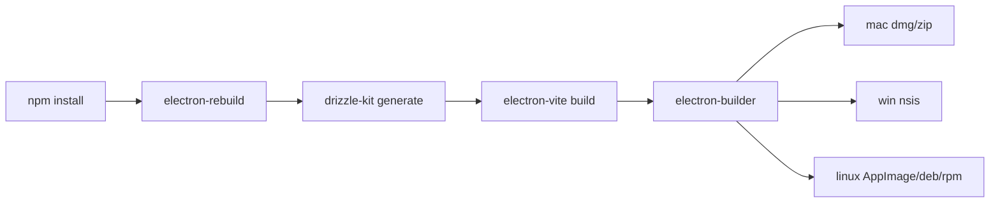

# Nodex на Electron с Vue, Drizzle и SQLite

## Executive summary

Для **Nodex** я рекомендую не «официально-минималистичную», а **практически надежную** связку: **Electron + electron-vite + Vue 3 + Vue Router + Pinia + Drizzle ORM + better-sqlite3 + electron-builder**. Причина проста. `electron-vite` сегодня дает лучший DX для разделения **main / preload / renderer**, быстрый dev-цикл с HMR в renderer и hot-reload для main/preload, а **Electron Forge с Vite-плагином в официальной документации по-прежнему помечен как experimental**. Для упаковки бинарников `electron-builder` сейчас выглядит практичнее: это полноценная система для macOS/Windows/Linux, с поддержкой подписывания, инсталляторов, rebuild native-модулей и автоматического unpack нативных `.node`-зависимостей. citeturn17view4turn25view2turn17view0turn17view3turn20search0turn21view0turn21view5

Для базы данных лучшая точка интеграции — **не renderer**, а **Electron main process**. Electron прямо строится вокруг разделения ролей процессов, preload нужен как безопасный мост, а IPC — канонический путь для вызовов privileged API из UI. Drizzle официально поддерживает SQLite через `better-sqlite3`, `node:sqlite` и `libsql`; для локальной embedded-базы в desktop-приложении самый прямой и зрелый вариант — `better-sqlite3`. Он синхронный, быстрый и хорошо подходит для локальной single-user БД; при тяжелых операциях его можно выносить в worker thread/utility process, но для типового CRUD в desktop-приложении базовая схема «singleton connection в main + IPC API в preload» остается самой простой и предсказуемой. citeturn34search0turn34search1turn33view3turn33view5turn33view4turn11view0turn10view3turn32search1

Для маршрутизации в Electron **почти всегда выбирайте `createWebHashHistory()`**, а не `createWebHistory()`. Причина не эстетическая, а эксплуатационная: при packaged-запуске без обычного web-server-а history mode ломается на прямых переходах/рефрешах, а hash mode предназначен как раз для `file://` и хостов без server-side fallback. Если позже захотите усилить безопасность локального UI, следующим шагом будет переход с `file://` на custom protocol (`app://`), потому что security guide Electron предпочитает custom protocol вместо `file://`. citeturn25view4turn25view5turn32search3turn33view4

Для хранения данных не кладите SQLite в корень проекта и не держите ее рядом с бинарником. Правильное место — **`app.getPath('userData')`**, потому что Electron нормализует его под ОС: `%APPDATA%` на Windows, `~/Library/Application Support` на macOS и `$XDG_CONFIG_HOME`/`~/.config` на Linux. Но есть важная тонкость: Electron рекомендует хранить app-specific данные в **подпапке внутри `userData`**, а не прямо в корне `userData`; и отдельно не стоит называть каталог буквально `databases`, потому что это имя фигурирует в breaking-change cleanup, связанной с историческим WebSQL cleanup. Для Nodex лучше использовать что-то вроде `userData/data/nodex.sqlite`. citeturn33view0turn6search4

По состоянию на **22 мая 2026** безопасный и современный baseline для tooling такой: **Electron 42.2.0**, **Node.js 24.16.0 LTS** для локальной разработки, **Vite 7.1.12**, **Vue 3.5.24**, **Vue Router 5.0.7**, **Pinia 3.0.4**, **Drizzle ORM 0.44.2**, **Drizzle Kit 0.31.10**, **better-sqlite3 12.10.0**, **electron-vite 5.0.0**, **electron-builder 26.11.0**, **@electron/rebuild 4.0.3**. Это дает одновременно свежую платформу и минимизирует ABI-сюрпризы для native addon-ов, потому что Electron 42 уже идет на Node 24.x, а electron-vite v5 требует современные Node/Vite-версии. citeturn0search20turn35search1turn0search18turn0search19turn27search0turn1search5turn0search21turn28search1turn4search2turn17view4turn29search0turn4search1

## Recommended architecture for Nodex

Архитектура, которая лучше всего балансирует **DX**, безопасность и надежность бинарника, выглядит так:

```mermaid
flowchart LR
  R[Vue 3 Renderer\nVue Router + Pinia] -->|typed API via window.nodex| P[Preload]
  P -->|ipcRenderer.invoke/send| M[Electron Main]
  M -->|Drizzle ORM| D[(SQLite file)]
  M -->|safeStorage| S[Secrets on disk]
  M -->|app.getPath('userData')| U[Per-OS user data dir]
  M -->|backup/export| B[Backups]
```

Ключевая идея: **renderer не знает о SQLite напрямую**. Он знает только о typed API, которое вы вручную открываете через `contextBridge` в preload. Это полностью соответствует security model Electron: renderer по умолчанию не должен иметь Node/Electron доступ, preload живет в изолированном контексте, а IPC — официальный канал взаимодействия между UI и main. Одновременно это удобно для DX: бизнес-операции живут в одном месте, ORM и файловая система не попадают в frontend bundle, а renderer остается обычным Vue-приложением. citeturn34search1turn33view3turn33view5turn33view4

Для Nodex я бы закрепил следующие правила проектирования. **Все БД-операции — в `src/main/db`**. **Все IPC-handlers — в `src/main/ipc`**. **Preload делает только bridge**, без бизнес-логики и без тяжелых зависимостей. Это особенно важно начиная с Electron 20, потому что preload sandboxed по умолчанию, и как только вы начнете тянуть туда лишние зависимости, легко поймать типичную ошибку `Unable to load preload scripts -> module not found`. electron-vite прямо рекомендует либо держать preload очень легким, либо полностью bundl-ить зависимости preload, либо отключать sandbox. Для Nodex разумнее держать preload минимальным и не отключать sandbox без необходимости. citeturn34search1turn32search1turn32search3

Почему именно **electron-vite + electron-builder**, а не другие паттерны:

| Инструмент | Что дает | Сильные стороны | Слабые стороны | Вердикт для Nodex |
|---|---|---|---|---|
| **electron-vite** | Bundling main/preload/renderer на базе Vite | Быстрый dev-цикл, HMR в renderer, hot-reload для main/preload, единая конфигурация, хорошие conventions. citeturn17view4turn25view2turn18search6 | Это **не packager** — нужен отдельный инструмент для дистрибуции. citeturn17view5turn18search13 | **Основной выбор для dev/build** |
| **electron-builder** | Packaging/distribution для macOS/Windows/Linux | Полный pipeline, installers, signing/notarization support, smart unpack native modules, rebuild native deps. citeturn20search0turn21view0turn21view5turn22view1 | Больше конфигурации, чем у «голого packager». | **Основной выбор для packaging** |
| **Electron Forge** | All-in-one lifecycle, makers/publishers/plugins | Хороший единый workflow, использует `@electron/rebuild`, есть plugin ecosystem. citeturn17view2turn33view2 | Официальный Vite template/plugin у Forge помечен как **experimental**. citeturn17view0turn17view3 | Хорошая альтернатива, но не мой первый выбор для Nodex |
| **@electron/packager** | Только bundling app bundle | Простой и прозрачный базовый слой. citeturn31search2 | Не делает installers/release pipeline сам по себе; для дистрибуции нужно собирать инфраструктуру вокруг него. citeturn31search2 | Не рекомендую как основной путь для этого проекта |

С точки зрения производительности БД я бы не вводил «connection pooling» как абстракцию ради галочки. Для embedded SQLite в десктопном приложении полезнее держать **один долгоживущий connection singleton** в main process и настраивать сам SQLite: включить `WAL`, включить `foreign_keys`, а для особенно критичных по надежности сценариев при необходимости поднять `synchronous = FULL`. Это не «серверная» БД, где pool почти обязательный; здесь стабильность и предсказуемость важнее. `better-sqlite3` сам рекомендует `WAL` ради общей производительности, а Drizzle в SQLite-сценарии работает поверх уже созданного database client instance. citeturn10view2turn10view3turn14search1

## Step-by-step setup

Базовый scaffolding я бы строил от **electron-vite Vue template**, потому что current-документация electron-vite прямо предлагает быстрый bootstrap и рекомендует конвенцию `src/main`, `src/preload`, `src/renderer`. Поскольку electron-vite v5 рассчитан на современную платформу, для локальной разработки используйте **Node 24 LTS**. citeturn16search0turn32search1turn17view4turn35search1

```bash
npm create @quick-start/electron@latest
# выбрать:
# framework: vue
# typescript: yes

cd nodex
npm install
```

После scaffold-а я бы **сразу выровнял зависимости по ролям процесса**. По документации electron-vite, зависимости main/preload, которые нужны в runtime packaged-приложению, должны быть в `dependencies`, а renderer-only библиотеки для Vite-бандла можно держать в `devDependencies`, поскольку packaging tools их обычно не включают, а renderer все равно получит их в собранном bundle. Это нетипично для обычного SPA, но для Electron дает более аккуратный финальный пакет. citeturn25view3

```bash
npm i -E drizzle-orm@0.44.2 better-sqlite3@12.10.0

npm i -D -E \
  electron@42.2.0 \
  electron-vite@5.0.0 \
  vite@7.1.12 \
  @vitejs/plugin-vue@6.0.7 \
  vue@3.5.24 \
  vue-router@5.0.7 \
  pinia@3.0.4 \
  drizzle-kit@0.31.10 \
  electron-builder@26.11.0 \
  @electron/rebuild@4.0.3 \
  typescript@6.0.3 \
  vitest@4.1.7 \
  @playwright/test@1.60.0 \
  eslint@10.4.0
```

Версии выше отражают свежие stable-релизы на дату исследования; для Electron и `electron-builder` я бы в реальном проекте **фиксировал exact versions**, а не оставлял `^`, чтобы уменьшить риск неожиданных ABI/build изменений у native dependencies. citeturn0search20turn0search18turn0search19turn27search0turn1search5turn0search21turn28search1turn4search2turn17view4turn29search0turn4search1turn36search0turn36search1turn37search0turn39search1turn39search0

Рекомендуемая структура проекта для Nodex:

```text
nodex/
├─ build/
│  ├─ icons/
│  └─ entitlements.mac.plist
├─ drizzle/
│  └─ ...generated SQL migrations...
├─ scripts/
│  └─ migrate-dev.mjs
├─ src/
│  ├─ main/
│  │  ├─ index.ts
│  │  ├─ ipc/
│  │  │  └─ index.ts
│  │  └─ db/
│  │     ├─ client.ts
│  │     ├─ migrate.ts
│  │     └─ schema/
│  │        └─ notes.ts
│  ├─ preload/
│  │  └─ index.ts
│  └─ renderer/
│     ├─ index.html
│     └─ src/
│        ├─ main.ts
│        ├─ App.vue
│        ├─ router/
│        │  └─ index.ts
│        ├─ stores/
│        │  └─ notes.ts
│        ├─ views/
│        │  └─ HomeView.vue
│        └─ types/
├─ electron.vite.config.ts
├─ drizzle.config.ts
├─ package.json
├─ .env
├─ .env.development
├─ .env.production
└─ .gitignore
```

Эта структура совпадает с тем, как electron-vite ожидает entry points по умолчанию: `src/main`, `src/preload` и `src/renderer/index.html`. Чем ближе вы держитесь этой конвенции, тем меньше шансов словить path-problems в dev/prod. citeturn18search6turn32search1

`electron.vite.config.ts` я бы задал так:

```ts
import { defineConfig } from 'electron-vite'
import vue from '@vitejs/plugin-vue'
import { resolve } from 'node:path'

export default defineConfig({
  main: {
    build: {
      outDir: 'out/main',
      externalizeDeps: true,
      rollupOptions: {
        external: ['better-sqlite3']
      }
    }
  },
  preload: {
    build: {
      outDir: 'out/preload',
      externalizeDeps: true
    }
  },
  renderer: {
    root: 'src/renderer',
    plugins: [vue()],
    resolve: {
      alias: {
        '@renderer': resolve(__dirname, 'src/renderer/src')
      }
    },
    build: {
      outDir: 'out/renderer'
    }
  }
})
```

Такой конфиг прямо следует модели electron-vite: собирать все в один `out`-дерево и **оставлять native addon `better-sqlite3` external**, а renderer — бандлить как обычный Vite app. official docs electron-vite рекомендуют держать весь production output в одном каталоге, а зависимости main/preload по умолчанию external-ить. citeturn17view5turn25view3

Минимальный `src/main/index.ts`:

```ts
import { app, BrowserWindow } from 'electron'
import { fileURLToPath } from 'node:url'
import { dirname, join } from 'node:path'
import { initDatabase } from './db/client'
import { runMigrations } from './db/migrate'
import { registerIpcHandlers } from './ipc'

const __dirname = dirname(fileURLToPath(import.meta.url))

let mainWindow: BrowserWindow | null = null

async function createWindow() {
  mainWindow = new BrowserWindow({
    width: 1280,
    height: 900,
    show: false,
    webPreferences: {
      preload: join(__dirname, '../preload/index.js'),
      contextIsolation: true,
      nodeIntegration: false
    }
  })

  if (!app.isPackaged && process.env.ELECTRON_RENDERER_URL) {
    await mainWindow.loadURL(process.env.ELECTRON_RENDERER_URL)
  } else {
    await mainWindow.loadFile(join(__dirname, '../renderer/index.html'))
  }

  mainWindow.once('ready-to-show', () => mainWindow?.show())
}

app.whenReady().then(async () => {
  initDatabase()
  runMigrations()
  registerIpcHandlers()
  await createWindow()

  app.on('activate', async () => {
    if (BrowserWindow.getAllWindows().length === 0) {
      await createWindow()
    }
  })
})

app.on('window-all-closed', () => {
  if (process.platform !== 'darwin') app.quit()
})
```

Здесь важно две вещи. Во-первых, production entry должен быть `./out/main/index.js` в `package.json`, потому что так рекомендует electron-vite. Во-вторых, `loadURL` в dev и `loadFile` в production — это стандартный паттерн electron-vite. citeturn16search0turn25view2

Минимальный preload лучше держать предельно узким:

```ts
import { contextBridge, ipcRenderer } from 'electron'

const nodexApi = {
  notes: {
    list: () => ipcRenderer.invoke('notes:list'),
    create: (payload: { title: string; body: string }) =>
      ipcRenderer.invoke('notes:create', payload)
  },
  app: {
    version: () => ipcRenderer.invoke('app:version')
  }
}

contextBridge.exposeInMainWorld('nodex', nodexApi)
```

Electron security docs рекомендуют **не экспонировать сырой `ipcRenderer` целиком**, а выдавать только узкие, целевые функции. Именно так и надо делать в Nodex: `window.nodex.notes.list()` лучше, чем `window.electron.ipcRenderer.invoke(anything)`. citeturn33view3turn33view4turn33view5

Vue-часть остается обычной:

```ts
// src/renderer/src/main.ts
import { createApp } from 'vue'
import { createPinia } from 'pinia'
import router from './router'
import App from './App.vue'

createApp(App).use(createPinia()).use(router).mount('#app')
```

```ts
// src/renderer/src/router/index.ts
import { createRouter, createWebHashHistory } from 'vue-router'

const routes = [
  {
    path: '/',
    name: 'home',
    component: () => import('@renderer/views/HomeView.vue')
  }
]

export default createRouter({
  history: createWebHashHistory(),
  routes
})
```

```ts
// src/renderer/src/stores/notes.ts
import { defineStore } from 'pinia'
import { ref } from 'vue'

export const useNotesStore = defineStore('notes', () => {
  const items = ref<any[]>([])
  const loading = ref(false)

  async function refresh() {
    loading.value = true
    try {
      items.value = await window.nodex.notes.list()
    } finally {
      loading.value = false
    }
  }

  async function create(title: string, body: string) {
    await window.nodex.notes.create({ title, body })
    await refresh()
  }

  return { items, loading, refresh, create }
})
```

Pinia остается хорошим выбором для DX: официальный API прост, store-ы HMR-friendly, а тестирование store-ов документировано отдельно. Vue Router в hash mode — сознательный выбор именно под packaged Electron. citeturn26search4turn26search5turn26search14turn26search3turn25view4turn25view5

Итоговые npm scripts я бы сделал такими:

```json
{
  "type": "module",
  "main": "./out/main/index.js",
  "scripts": {
    "dev": "electron-vite dev",
    "dev:watch": "electron-vite dev --watch",
    "build": "electron-vite build",
    "rebuild:native": "electron-rebuild -f -w better-sqlite3",
    "postinstall": "npm run rebuild:native",
    "db:generate": "drizzle-kit generate --name init",
    "db:migrate:dev": "node scripts/migrate-dev.mjs",
    "lint": "eslint .",
    "test": "vitest run",
    "test:watch": "vitest",
    "e2e": "playwright test",
    "dist": "npm run build && electron-builder",
    "dist:win": "npm run build && electron-builder --win",
    "dist:mac": "npm run build && electron-builder --mac",
    "dist:linux": "npm run build && electron-builder --linux"
  }
}
```

`electron-rebuild` стоит держать обязательно, потому что Electron использует другой ABI, и native-модули после `npm install`/апгрейда Electron часто требуют rebuild. Electron docs рекомендуют именно `@electron/rebuild`, а Forge, кстати, использует его автоматически. citeturn33view2

## Drizzle and SQLite integration

Для Nodex я рекомендую **code-first flow**: схема в TypeScript, SQL-мigrations генерируются через `drizzle-kit generate`, а приложение на старте прогоняет pending migrations через embedded `migrate()` из `drizzle-orm/better-sqlite3/migrator`. Это самый предсказуемый путь для desktop software, потому что:
  
- схема и migrations versioned в git;
- packaged app применяет только недостающие миграции;
- Drizzle логирует примененные миграции в `__drizzle_migrations`;
- обновления бинарника не требуют отдельного внешнего installer-step для БД. citeturn11view3turn11view2

`drizzle.config.ts` для генерации SQL можно держать минимальным:

```ts
import { defineConfig } from 'drizzle-kit'

export default defineConfig({
  dialect: 'sqlite',
  schema: './src/main/db/schema/*.ts',
  out: './drizzle'
})
```

Drizzle docs прямо говорят, что для `generate` достаточно задать `dialect` и `schema`, а configuration file — рекомендуемый способ настройки. citeturn11view3

Пример схемы:

```ts
// src/main/db/schema/notes.ts
import { sqliteTable, integer, text } from 'drizzle-orm/sqlite-core'

export const notes = sqliteTable('notes', {
  id: integer('id').primaryKey({ autoIncrement: true }),
  title: text('title').notNull(),
  body: text('body').notNull(),
  createdAt: integer('created_at', { mode: 'timestamp_ms' }).notNull()
})
```

```ts
// src/main/db/client.ts
import fs from 'node:fs'
import path from 'node:path'
import { app } from 'electron'
import Database from 'better-sqlite3'
import { drizzle } from 'drizzle-orm/better-sqlite3'
import * as schema from './schema/notes'

let sqlite: Database.Database | null = null
let db: ReturnType<typeof drizzle> | null = null

export function getDbPaths() {
  const dataDir = path.join(app.getPath('userData'), 'data')
  const backupDir = path.join(dataDir, 'backups')
  const dbPath = path.join(dataDir, 'nodex.sqlite')
  return { dataDir, backupDir, dbPath }
}

export function initDatabase() {
  if (db) return db

  const { dataDir, backupDir, dbPath } = getDbPaths()
  fs.mkdirSync(dataDir, { recursive: true })
  fs.mkdirSync(backupDir, { recursive: true })

  sqlite = new Database(dbPath)
  sqlite.pragma('journal_mode = WAL')
  sqlite.pragma('foreign_keys = ON')

  db = drizzle(sqlite, {
    schema,
    logger: !app.isPackaged
  })

  return db
}

export function getSqlite() {
  if (!sqlite) throw new Error('SQLite is not initialized')
  return sqlite
}
```

Почему так. `userData` — это canonical путь для app data в Electron. Electron отдельно рекомендует хранить app-specific файлы в подпапке внутри `userData`, а не в самом корне. Я намеренно использую подпапку `data`, а не `databases`, чтобы не попасть в историческую breaking-change cleanup логику по имени `databases`. `WAL` — базовая настройка производительности для SQLite/better-sqlite3; если Nodex будет хранить особенно важные данные и вы готовы обменять скорость на durability, можно дополнительно включить `synchronous = FULL`. citeturn33view0turn6search4turn10view2turn10view3

Миграции на первом запуске:

```ts
// src/main/db/migrate.ts
import path from 'node:path'
import { app } from 'electron'
import { migrate } from 'drizzle-orm/better-sqlite3/migrator'
import { initDatabase, getSqlite } from './client'

export function runMigrations() {
  const db = initDatabase()
  const sqlite = getSqlite()

  const migrationsFolder = app.isPackaged
    ? path.join(app.getAppPath(), 'drizzle')
    : path.join(process.cwd(), 'drizzle')

  // См. замечание в troubleshooting ниже по поводу FK и table rebuild.
  sqlite.pragma('foreign_keys = OFF')
  try {
    migrate(db, { migrationsFolder })
  } finally {
    sqlite.pragma('foreign_keys = ON')
  }
}
```

Здесь есть важный packaging-момент: **папка `drizzle/` должна попасть в packaged app**, потому что runtime migrator читает SQL-файлы с диска. Plain text/sql файлы можно держать внутри ASAR; unpack обязателен прежде всего для native `.node` файлов и исполняемых бинарников. Поэтому для миграций достаточно включить `drizzle/**/*` в packaging `files`. citeturn14search1turn21view0turn6search2

Отдельный dev script для локальной базы без запуска Electron:

```js
// scripts/migrate-dev.mjs
import path from 'node:path'
import Database from 'better-sqlite3'
import { drizzle } from 'drizzle-orm/better-sqlite3'
import { migrate } from 'drizzle-orm/better-sqlite3/migrator'

const dbFile = path.resolve('devdata', 'nodex.dev.sqlite')
const sqlite = new Database(dbFile)
const db = drizzle(sqlite)

sqlite.pragma('journal_mode = WAL')
sqlite.pragma('foreign_keys = OFF')
try {
  migrate(db, { migrationsFolder: path.resolve('drizzle') })
} finally {
  sqlite.pragma('foreign_keys = ON')
  sqlite.close()
}
```

Если смотреть на «connection pooling» строго, то я бы для Nodex **не вводил его вообще**. Для SQLite в desktop-сценарии правильнее мыслить не pool-ом, а **одним runtime connection**. `better-sqlite3` — синхронный и рассчитан на локальную SQLite-модель; его docs отдельно подчеркивают serialized nature SQLite и рекомендуют `WAL`, а для тяжелых запросов упоминают worker thread support. То есть если позже у вас появятся тяжелый импорт, FTS-индексация или отчетность, это повод вынести такие задачи в worker/utility process, но не повод имитировать серверный pool внутри простого local app. citeturn10view3turn10view2turn32search1

Бэкапы для пользовательских данных делайте не «копированием `.sqlite` файла наугад во время работы приложения», а через `better-sqlite3` backup API. Он поддерживает online backup и прямо документирован для ongoing use. Это особенно полезно, когда БД уже в `WAL`-режиме. Практически для Nodex я бы делал:
  
- автоматический backup перед первой миграцией после апдейта приложения;
- ручную команду «Экспорт резервной копии»;
- ротацию, например, последних 5–10 backup-файлов. citeturn10view0turn9search2turn9search5

## Packaging, environment and user data

В production я бы складывал packaged output через **electron-builder**. Его можно конфигурировать в `package.json` через top-level `build`, а сам он умеет packaging для macOS/Windows/Linux, supports signing/notarization, умеет smart unpack native modules и работать с native rebuild. Для Nodex это лучший путь, потому что у вас есть native dependency `better-sqlite3`, а значит вопрос «как собрать и не сломать бинарник» становится важнее, чем минимализм tooling. citeturn20search0turn20search7turn21view0turn21view5

Минимальный `build`-блок:

```json
{
  "build": {
    "appId": "com.nodex.app",
    "productName": "Nodex",
    "directories": {
      "output": "release",
      "buildResources": "build"
    },
    "files": [
      "out/**/*",
      "drizzle/**/*",
      "package.json"
    ],
    "asar": true,
    "npmRebuild": true,
    "nativeRebuilder": "parallel",
    "mac": {
      "target": ["dmg", "zip"],
      "category": "public.app-category.productivity",
      "hardenedRuntime": true
    },
    "win": {
      "target": ["nsis"]
    },
    "linux": {
      "target": ["AppImage", "deb", "rpm"],
      "category": "Utility"
    }
  }
}
```

Почему этого обычно хватает. `electron-builder` уже умеет **smart unpack** для native modules и по docs обычно не требует ручного `asarUnpack`, если кейс обычный. Но если конкретно у `better-sqlite3` на какой-то платформе будет странное поведение загрузки, ваш safe fallback — добавить `"asarUnpack": ["**/*.node"]`. Плюс builder имеет настройки `npmRebuild` и `nativeRebuilder`, а значит packaging-этап умеет сам rebuild native dependencies под target Electron/OS. citeturn21view0turn22view3turn21view5

Build pipeline для Nodex я бы мыслил так:



С точки зрения env management для Electron + Vite действуют **две разные логики**. У Vite есть классическая модель `.env`, `.env.local`, `.env.[mode]`, `.env.[mode].local`, а клиентский bundle получает только переменные с `VITE_`-префиксом. У electron-vite поверх этого добавлены process-scoped префиксы: `MAIN_VITE_`, `PRELOAD_VITE_`, `RENDERER_VITE_`, плюс `VITE_` как shared. Это удобно, но есть критическое правило: **ничего секретного в этих префиксах хранить нельзя**, потому что переменные становятся частью build/runtime surface и могут быть доступны из собранного приложения. Для секретов используйте не `.env`, а main-process storage с OS crypto. citeturn25view0turn25view1

Пример sane `.env`-схемы для Nodex:

```dotenv
# .env
VITE_APP_NAME=Nodex
MAIN_VITE_DB_FILENAME=nodex.sqlite
MAIN_VITE_DATA_SUBDIR=data
MAIN_VITE_LOG_LEVEL=info
RENDERER_VITE_ENABLE_DEVTOOLS=false
```

```dotenv
# .env.development
MAIN_VITE_DB_FILENAME=nodex.dev.sqlite
RENDERER_VITE_ENABLE_DEVTOOLS=true
```

```dotenv
# .env.production
MAIN_VITE_DB_FILENAME=nodex.sqlite
RENDERER_VITE_ENABLE_DEVTOOLS=false
```

```dotenv
# .env.local  (gitignored)
# не использовать для секретов, которые нельзя засветить в build
```

Runtime-путь БД должен вычисляться не из абсолютного пути в `.env`, а из **`app.getPath('userData')` + относительные куски конфигурации**. Для установленных приложений это даст примерно такие значения:

| ОС | Базовый `userData` | Рекомендуемый путь БД для Nodex |
|---|---|---|
| Windows | `%APPDATA%/Nodex` | `%APPDATA%/Nodex/data/nodex.sqlite` |
| macOS | `~/Library/Application Support/Nodex` | `~/Library/Application Support/Nodex/data/nodex.sqlite` |
| Linux | `$XDG_CONFIG_HOME/Nodex` или `~/.config/Nodex` | `~/.config/Nodex/data/nodex.sqlite` |

Это следует из `appData`/`userData` semantics в Electron. Имейте в виду, что docs отдельно не рекомендуют писать туда **очень большие файлы**, потому что некоторые системы могут включать эту директорию в облачный backup. Поэтому SQLite и небольшие app-data файлы — да; тяжелые вложения, медиаархивы или workspace-кэши — лучше вынести в другое место. citeturn33view0

Для секретов и токенов в desktop runtime я бы делал так: **все секретное хранить только в main process**, а на диск писать либо зашифрованный blob через `safeStorage`, либо использовать platform keychain strategy, если вам нужна более «нативная» схема credential storage. Из официального Electron API минимум, который уже у вас есть без дополнительных пакетов, — это `safeStorage`, работающий в main process и использующий системную криптографию ОС; Electron прямо рекомендует async API (`encryptStringAsync` / `decryptStringAsync`). citeturn33view1

Подписывание и notarization я бы воспринимал как отдельный release-layer, а не как часть локального dev. Для `electron-builder` на CI задаются environment variables вроде `CSC_LINK` и `CSC_KEY_PASSWORD`, и builder автоматически включает signing, если credentials присутствуют. Для macOS direct distribution нужен **Developer ID Application**, а notarization для приложений вне Mac App Store на современных macOS — фактически обязательный этап; Gatekeeper проверяет нотаризованные приложения. Для Windows signing поддерживается тоже, но в 2026 году **EV-сертификат больше не дает автоматического обхода SmartScreen** — Microsoft прямо пишет, что SmartScreen сейчас reputation-based, и переплачивать за EV только ради обхода warning больше неразумно. Microsoft отдельно продвигает **Azure Artifact Signing** как рекомендуемый вариант для non-Store distribution. citeturn22view1turn21view2turn23search0turn23search2turn24search0turn24search16

Для macOS стоит помнить еще одну практическую деталь: при hardened runtime и arm64 Electron могут понадобиться корректные entitlements, иначе приложение может падать; docs electron-builder отдельно упоминают, что для Electron 20+ на arm64 часто нужен `com.apple.security.cs.allow-jit`. Для Nodex я бы заранее держал `build/entitlements.mac.plist` в репозитории, даже если на первом этапе будете собирать неподписанные debug-bundles. citeturn20search21turn20search14

Для Linux мой практический набор targets — **AppImage + deb + rpm**. `AppImage` хорош как универсальный single-file дистрибутив, `deb` и `rpm` нужны для более нативной интеграции в дистрибутивы. `Snap` я бы не включал по умолчанию, если у вас нет явного плана на Ubuntu store-модель. На официальных docs electron-builder покрытие Linux targets широкое, но для обычного независимого desktop-приложения три цели выше дают лучший баланс совместимости и поддержки. citeturn22view3

И еще одна критически важная вещь: **не рассчитывайте всерьез, что вы будете идеально собирать все три платформы из одной ОС**, особенно если есть native dependencies. Electron-builder прямо предупреждает: native dependencies обычно должны компилироваться на target platform, а macOS signing вообще работает только на macOS. Практически для Nodex правильный путь — **CI matrix на macOS / Windows / Ubuntu**, а не «магическая one-machine cross-build». citeturn21view3turn21view4

## Testing, CI and troubleshooting

Для Nodex я бы разделил тесты на три уровня. Первый — **unit/integration на бизнес-логике**: `src/main/db`, сервисы и schema-операции гоняются через Vitest на временной SQLite базе. Второй — **renderer unit tests** для Vue-компонентов и store-логики. Третий — **smoke/e2e** на packaged или dev Electron app. Это дает реальную защиту от регрессий в трех самых уязвимых местах: миграции, IPC-контракты и packaged startup. Vitest остается естественным выбором для stack на Vite, а Pinia отдельно документирует testing flow для store-ов. Для e2e можно использовать Playwright, но важно понимать, что его Electron automation по официальной docs все еще **experimental** — поэтому я бы держал его именно как smoke/user-journey уровень, а не как единственный барьер качества. citeturn37search0turn26search3turn38search0turn38search2

CI для Nodex логично строить на **GitHub Actions matrix** по трем ОС. electron-builder имеет отдельный guide по GitHub Actions, где рекомендует хранить сертификаты, пароли и токены в repository secrets и собирать платформы параллельно матрицей. Для этого проекта я бы делал последовательность: `npm ci` → `npm run lint` → `npm run test` → `npm run build` → `npm run dist`. Если release-пайплайн еще не полноценный, хотя бы добавьте smoke step, который запускает приложение и убеждается, что оно стартует и сразу закрывается без main-process exceptions. citeturn21view4

Ниже — практический checklist типовых ошибок, которые реально встречаются именно в таком стекe:

- **`The module ... was compiled against a different Node.js version`**. Это классический ABI mismatch native module vs Electron. Лечение: запускать `@electron/rebuild`, делать это после апдейта Electron, и не забывать, что packaging тоже должен rebuild-ить native deps. citeturn33view2
- **`Cannot find module 'better-sqlite3'` в packaged app**. Обычно это означает либо неправильную классификацию зависимости в `devDependencies`, либо проблемы с ASAR/native unpack. Для main-runtime зависимостей вроде `better-sqlite3` используйте `dependencies`. Если нужно — принудительно добавьте `asarUnpack: ["**/*.node"]`. citeturn25view3turn32search3turn21view0
- **`vue-router works in dev but not production`**. Для Electron production используйте `createWebHashHistory()`, иначе packaged navigation ломается. citeturn32search3turn25view4turn25view5
- **`Unable to load preload scripts -> Error: module not found: 'XXX'`**. Начиная с Electron 20 preload sandboxed по умолчанию. Решение: держать preload минимальным, полностью bundl-ить preload dependencies или только в крайнем случае ставить `sandbox: false`. citeturn34search1turn32search3turn32search1
- **`ERR_REQUIRE_ESM`**. Современные пакеты часто ESM-only. electron-vite прямо рекомендует либо идти в ESM-проект, либо исключать конкретные пакеты из externalization и бандлить их под CJS-окружение. Для нового Nodex я бы шел сразу в ESM-first. citeturn32search3turn34search5
- **SQLite migration с foreign keys падает на table rebuild**. У Drizzle есть недавние открытые issue, где показано, что generated SQLite migrations c `PRAGMA foreign_keys=OFF` внутри migration transaction могут не срабатывать так, как ожидает разработчик. Поэтому если миграция перестраивает таблицу и вы ловите FK errors, рабочий обходной путь — выставлять `foreign_keys = OFF` **на raw SQLite handle до вызова `migrate()`**, а затем возвращать `ON`. Это не официальная «идеальная» история, а практический workaround из актуальных issue/discussions, и именно поэтому я заложил его в пример. citeturn14search2turn14search4
- **Странные install/build ошибки у `better-sqlite3` на Windows**. Смотрите базовые рекомендации автора библиотеки: свежая поддерживаемая Node.js, установленные native build tools, отсутствие спецсимволов/пробелов в project path, `electron-rebuild` для Electron и unpack native libs из ASAR. citeturn10view1turn35search0

Итоговый operational checklist для Nodex перед первым публичным релизом я бы формулировал так:  
**фиксируйте exact versions**, **держите БД только в main**, **preload делайте узким**, **router — только hash mode**, **SQLite — в `userData/data`, не в `databases`**, **миграции коммитьте как SQL и запускайте на старте**, **native modules rebuild-ите после апдейта Electron**, **собирайте каждую ОС на своей CI-platform**, **не кладите secrets в `.env` с Vite/electron-vite префиксами**, **для macOS готовьте signing/notarization отдельно, для Windows — reputation-aware signing without EV myths**. citeturn33view0turn33view5turn25view4turn11view2turn33view2turn21view3turn25view0turn25view1turn23search2turn24search0

Есть две рабочие оговорки. Первая: **Vue Router 5** уже latest stable, но часть интернет-примеров по Electron/Vue все еще написана под 4.x; в этом отчете я сознательно использовал API и подходы, которые остаются совместимыми по смыслу и не завязаны на v5-only features. Вторая: я сознательно **не делал ставку на Electron Forge Vite stack**, потому что official docs Forge сами помечают этот путь как experimental, а ваша цель — надежный бинарник и спокойная эксплуатация, а не «самый официальный» стек на бумаге. citeturn27search1turn27search4turn17view0turn17view3